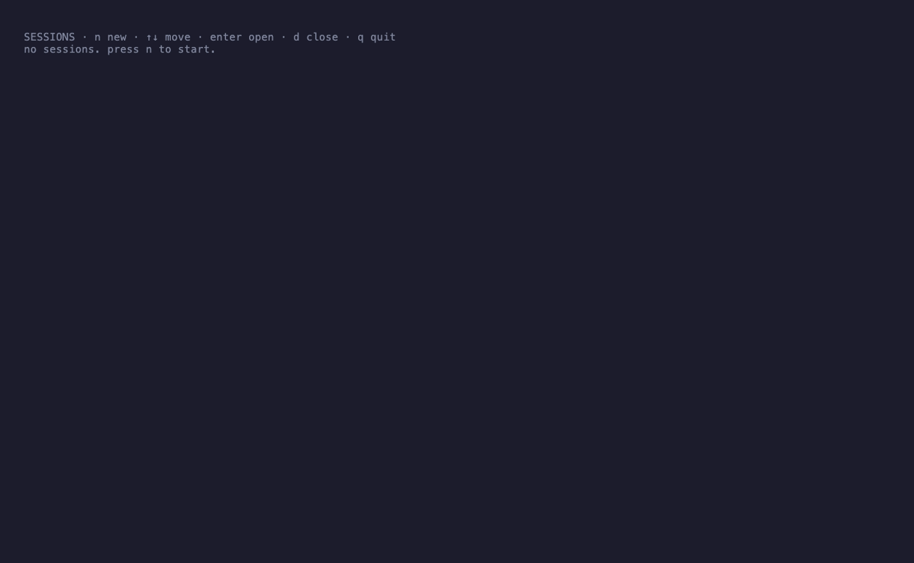
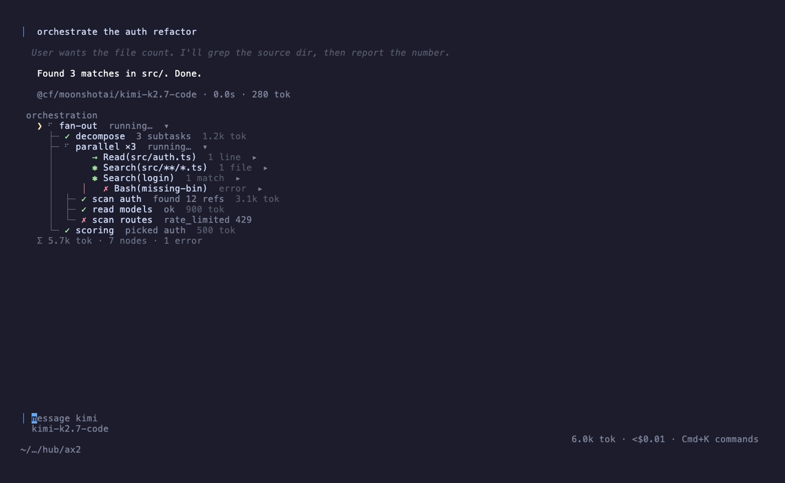
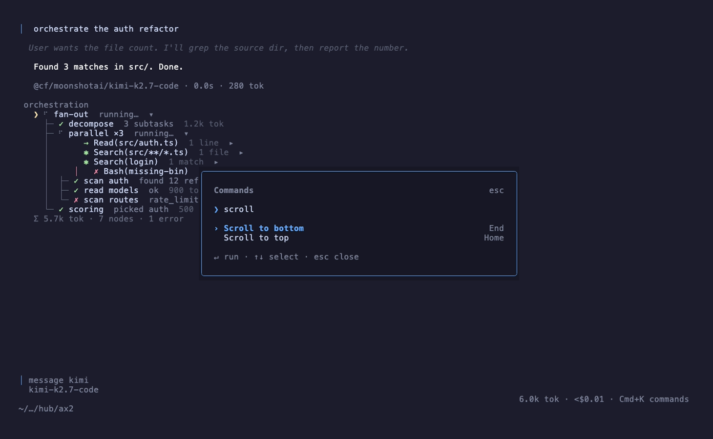
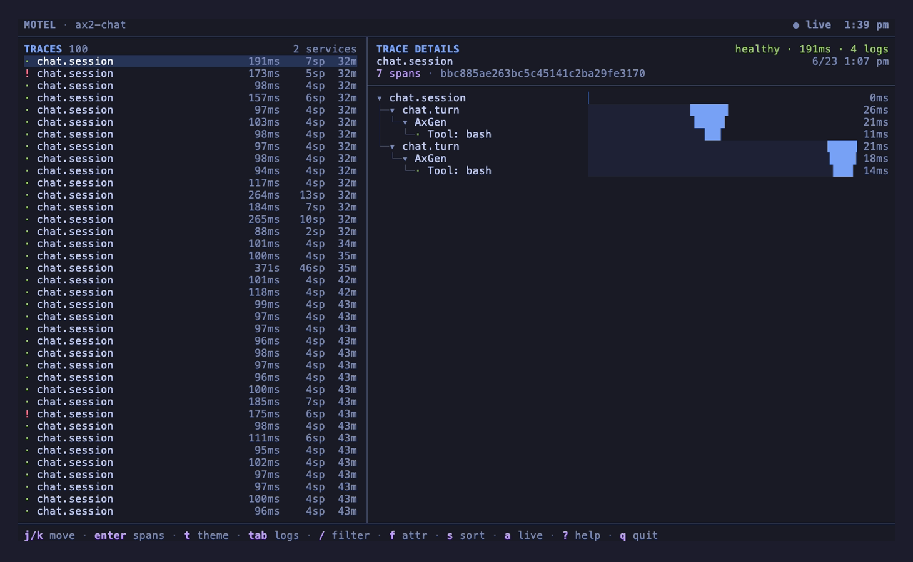

<p align="center">
  <h1 align="center">rlmcode</h1>
</p>

<p align="center">A self-orchestrating TUI coding agent.</p>

<p align="center">
  
  
  
  
</p>

<p align="center">
  
</p>

The model doesn't just call tools. Mid-turn it **authors and runs a JS orchestration
script** — fanning out agents, judging candidates, piping phases, mining a giant blob — and
the engine runs it while a **live nested node-tree** renders every branch as it happens. One
OpenTelemetry trace per session mirrors the tree, exported to a local [`motel`](https://github.com/kitlangton/motel).

Built on Bun + [Effect v4](https://effect.website) + [opentui](https://github.com/sst/opentui) (React) + [@ax-llm/ax](https://github.com/ax-llm/ax) → Cloudflare Workers AI
(Kimi K2.7 / GLM 5.2).

<p align="center">
  
</p>

### What makes it different

- **`workflow` — the agent writes the orchestration.** Mid-turn the model authors a JS script
  over in-process prims (`phase` / `agent` / `parallel` / `pipeline` / `judge` / `rlm` /
  `budget`) and the engine runs it. Loops, conditionals, fan-out, best-of-N, verify — all
  expressible, not a fixed strategy menu.
- **`rlm()` — mine a huge blob out of the prompt.** A long file / log / concatenated module is
  loaded into a code runtime; the RLM actor writes JS to mine it for the answer. One prim among
  many, not a special tool.
- **Live node-tree.** Every fan-out, branch, and per-node tool cluster renders as a nested
  unicode tree, inline under the turn that spawned it — live status, tokens, and a Σ footer.
- **One trace per session.** `chat.session → turn → workflow → nodes`, real 3-signal
  OpenTelemetry to `motel` — the trace mirrors the live tree.
- **`⌘K` command palette** and an importable SDK at [`src/core/sdk.ts`](src/core/sdk.ts)
  (`createAgent → Agent`).

---

### Prerequisites

- [Bun](https://bun.sh) ≥ 1.3 — runtime + package manager.
- A [Cloudflare](https://dash.cloudflare.com) account with Workers AI + an API token (Workers AI
  permission) — for the real model. Skip it with `RLM_MOCK=1` (canned AI).

> [!TIP]
> No Cloudflare account? Run `RLM_MOCK=1 bun run chat` — canned AI drives the real turn loop and
> TUI with zero network.

### Install

```bash
bun install
cp .env.example .env   # fill in CLOUDFLARE_API_TOKEN + CLOUDFLARE_ACCOUNT_ID
```

### Quickstart

```bash
bun run chat                 # the agent (needs CF creds in .env)
RLM_MOCK=1 bun run chat      # zero credentials — canned AI, real turn loop + TUI
```

Hit `⌘K` for the command palette.

<p align="center">
  
</p>

> [!WARNING]
> The agent executes model-generated shell commands and JS **unsandboxed** in the working
> directory ([`src/core/tools.ts`](src/core/tools.ts)), and `bun run live` lets the model author
> and run code. Run only in a trusted directory, container, or VM.

### Tracing

```bash
bun run motel        # local trace ingest + API (127.0.0.1:27686)
bun run motel:tui    # the motel trace viewer
```

One trace per session — `chat.session → turn → workflow → nodes` — mirrors the live node-tree.

<p align="center">
  
</p>

### Architecture

```
src/core/   agent (turn = chat.turn span) · orch.ts (5 prims) · workflow.ts (the script tool)
            rlm-node.ts (the rlm prim) · tools.ts · runtime.ts · models.ts · sdk.ts
src/tui/    opentui React UI — transcript, composer, inline node-tree, theme, icons, ⌘K palette
src/otel.ts NodeSdk 3-signal (traces/logs/metrics) → motel
```

The core is importable as an SDK ([`src/core/sdk.ts`](src/core/sdk.ts)): `createAgent → Agent`
over a flat `TurnEvent` stream, with no Effect / OTel / ax types leaking past the barrel.

### Verify

```bash
bun run lint      # tsc + hermetic tests + design-check + ponytail-debt — the commit gate
bun run test:tui  # headless TUI frame gate (terminal-control PTY, mocked AI, zero network)
bun run live      # real CF-Kimi proof: the model authors + runs a workflow script
```

### License

MIT — see [LICENSE](LICENSE). Ported / reused third-party code is credited in
[THIRD-PARTY-LICENSES.md](THIRD-PARTY-LICENSES.md).

---

> [!NOTE]
> **Run `motel` from a local clone.** `bun add -g @kitlangton/motel` (npm 0.1.0) is broken against
> current Effect / opentui betas. The `motel` / `motel:tui` scripts run a local clone at `../motel`
> (`git clone https://github.com/kitlangton/motel ../motel`), which pins compatible deps.
